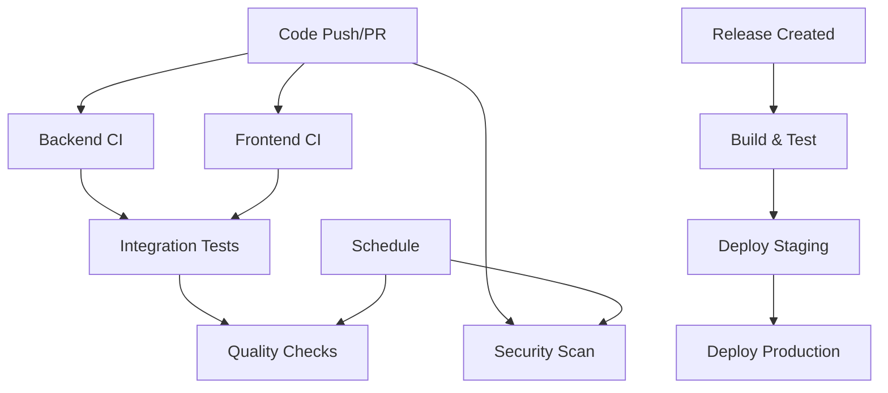

# GitHub Actions CI/CD Setup for Vinea ERP

This document describes the GitHub Actions workflows configured for the Vinea ERP project.

## 🚀 Workflows Overview

### 1. Backend CI/CD (`backend-ci.yml`)
**Triggers:** Push/PR to main branches, changes in `backend/` directory

**Features:**
- ✅ Python 3.12 with Poetry dependency management
- ✅ PostgreSQL 15 test database
- ✅ Code quality checks (flake8, black, isort, mypy)
- ✅ Security scanning (bandit, safety)
- ✅ Automated testing with coverage reporting
- ✅ Docker image building and pushing
- ✅ Staging and production deployment stages

### 2. Frontend CI/CD (`frontend-ci.yml`)
**Triggers:** Push/PR to main branches, changes in `frontend/` directory

**Features:**
- ✅ Node.js 20 with npm caching
- ✅ ESLint and TypeScript checking
- ✅ Jest testing with coverage
- ✅ Security audit (npm audit)
- ✅ Lighthouse performance testing
- ✅ Docker image building and pushing
- ✅ Staging and production deployment

### 3. Full-Stack Integration (`integration.yml`)
**Triggers:** Push/PR to main branches

**Features:**
- ✅ End-to-end testing with both services
- ✅ Docker Compose testing
- ✅ API integration tests
- ✅ Service health checks
- ✅ Cross-service communication validation

### 4. Security Scanning (`security.yml`)
**Triggers:** Push/PR to main branches, daily schedule

**Features:**
- ✅ Trivy vulnerability scanning
- ✅ CodeQL static analysis
- ✅ Python security (Bandit, Safety)
- ✅ Node.js security (npm audit)
- ✅ Secret detection (TruffleHog)
- ✅ Dependency review for PRs

### 5. Release & Deploy (`release.yml`)
**Triggers:** GitHub releases, manual workflow dispatch

**Features:**
- ✅ Semantic versioning for Docker images
- ✅ Staging deployment for pre-releases
- ✅ Production deployment for stable releases
- ✅ Smoke testing post-deployment
- ✅ Rollback capabilities
- ✅ Slack notifications

### 6. Code Quality & Monitoring (`quality.yml`)
**Triggers:** Push/PR to main branches, weekly schedule

**Features:**
- ✅ SonarQube analysis
- ✅ Code complexity analysis (Radon)
- ✅ Performance testing (Locust)
- ✅ API documentation generation
- ✅ Accessibility testing (axe-core)
- ✅ GitHub Pages documentation deployment

## 🔧 Required Secrets

Configure these secrets in your GitHub repository settings:

### Docker Registry
```
DOCKER_USERNAME        # Your Docker Hub username
DOCKER_PASSWORD        # Your Docker Hub password/token
```

### Code Quality
```
SONAR_TOKEN           # SonarQube authentication token
SONAR_HOST_URL        # SonarQube server URL
```

### Notifications
```
SLACK_WEBHOOK_URL     # Slack webhook for deployment notifications
```

### Lighthouse CI (Optional)
```
LHCI_GITHUB_APP_TOKEN # Lighthouse CI GitHub app token
```

### Deployment (Optional)
```
VERCEL_TOKEN          # Vercel deployment token
KUBECONFIG           # Kubernetes configuration
```

## 🏗️ Setting Up Secrets

1. Go to your repository on GitHub
2. Navigate to **Settings** → **Secrets and variables** → **Actions**
3. Click **New repository secret**
4. Add each secret with its corresponding value

## 🌍 Environment Configuration

The workflows support multiple environments:

### Staging Environment
- Triggered by pushes to `develop` branch
- Used for pre-release testing
- Runs comprehensive test suites

### Production Environment
- Triggered by releases or pushes to `main`/`master`
- Includes additional safety checks
- Requires manual approval (configure in repository settings)

## 📊 Monitoring & Reports

### Artifacts Generated
- **Code Coverage Reports** → Uploaded to Codecov
- **Security Scan Results** → GitHub Security tab
- **Performance Reports** → Downloadable artifacts
- **Quality Reports** → SonarQube dashboard
- **Documentation** → GitHub Pages

### Notifications
- **Slack Integration** → Deployment status updates
- **GitHub Checks** → PR status indicators
- **Email Notifications** → Failed workflow alerts

## 🔄 Workflow Dependencies



## 🛠️ Customization

### Adding New Environments
1. Create environment in repository settings
2. Add deployment step in relevant workflow
3. Configure environment-specific secrets

### Modifying Test Suites
1. Update test commands in workflow files
2. Adjust test database configuration if needed
3. Update coverage reporting settings

### Custom Deployment Targets
1. Replace deployment commands in workflows
2. Add required authentication secrets
3. Update health check endpoints

## 🚨 Troubleshooting

### Common Issues

**Poetry Installation Fails**
- Check Python version compatibility
- Verify Poetry cache configuration

**Docker Build Fails**
- Ensure Dockerfile paths are correct
- Check Docker registry credentials

**Tests Fail in CI**
- Verify environment variables
- Check database connectivity
- Review test isolation

**Deployment Fails**
- Validate deployment credentials
- Check target environment availability
- Review rollback procedures

### Getting Help

1. Check workflow logs in GitHub Actions tab
2. Review error messages in failed steps
3. Verify secrets configuration
4. Test locally with same environment

## 📚 Best Practices

1. **Branch Protection**: Enable required status checks
2. **Secret Rotation**: Regularly update authentication tokens
3. **Environment Isolation**: Use separate configs for each environment
4. **Monitoring**: Set up alerts for failed deployments
5. **Documentation**: Keep this README updated with changes

## 🔗 Useful Links

- [GitHub Actions Documentation](https://docs.github.com/en/actions)
- [Docker Documentation](https://docs.docker.com/)
- [Poetry Documentation](https://python-poetry.org/docs/)
- [Next.js Deployment](https://nextjs.org/docs/deployment)
